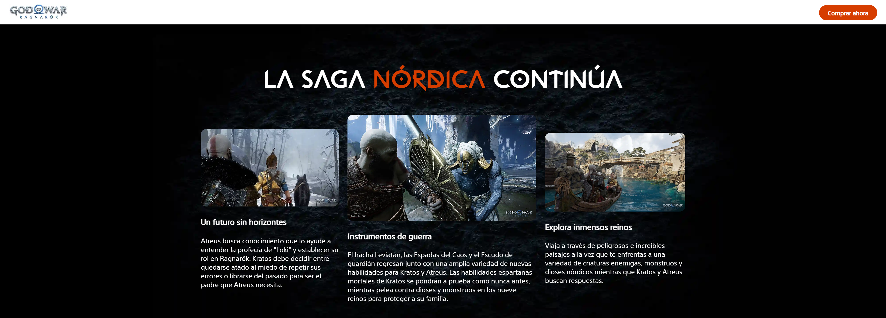
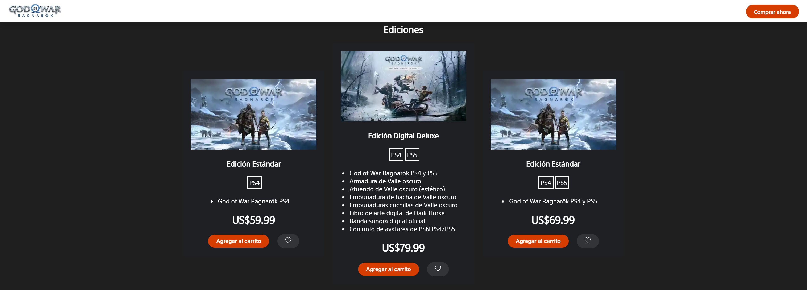
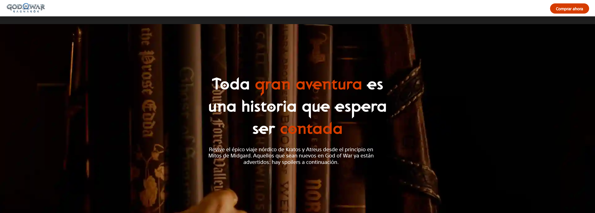
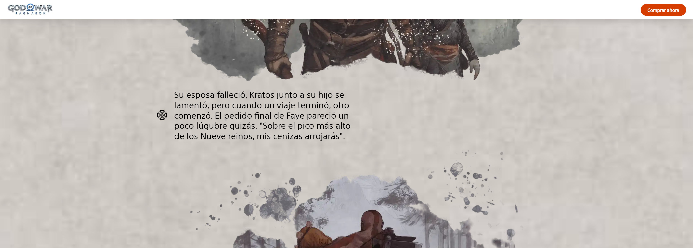
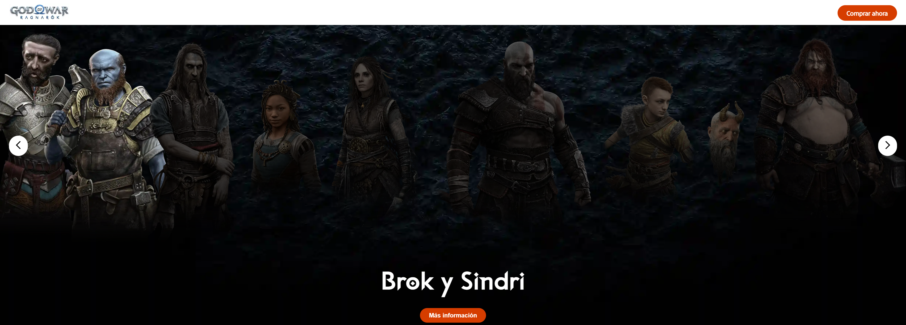
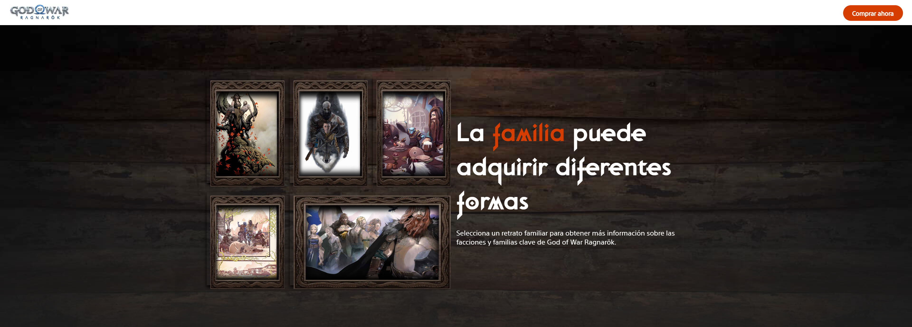
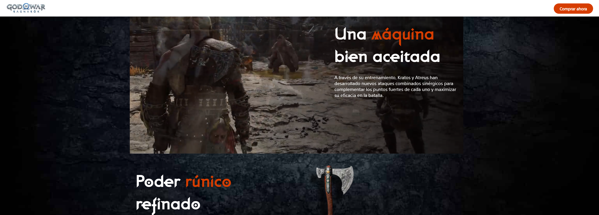
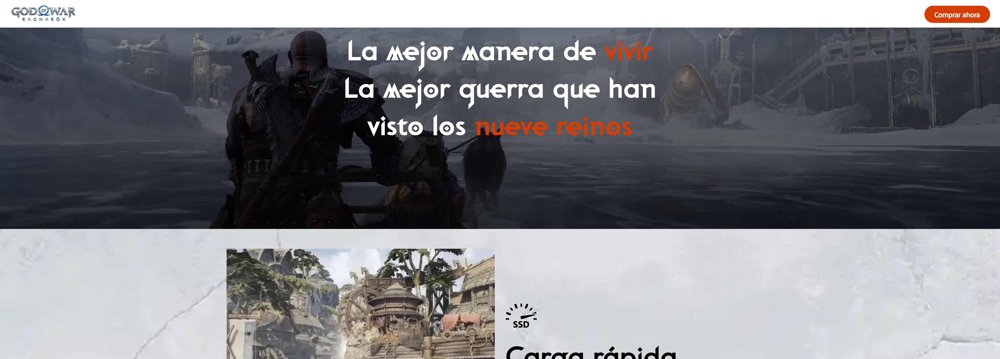
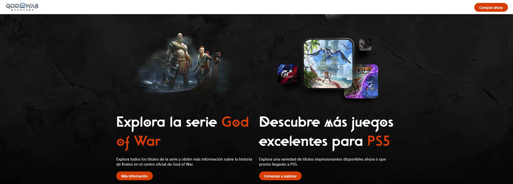
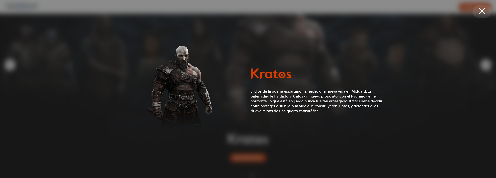

# God of War Ragnarok Clone

Descubre la saga del épico título y su nueva entrega God of War Ragnarök.

👉 Enlace: [https://god-of-war-ragnarok-clone.netlify.app/](https://god-of-war-ragnarok-clone.netlify.app/)  

  
  
  
  
  
  
  

## Resumen del nuevo título

Embárcate en un épico y cordial viaje mientras Kratos y Atreus luchan por aferrarse

## Saga épica

Los Nórdicos continúan

## Compra del juego

Distintas ediciones y más

👉 Enlace: [https://god-of-war-ragnarok-clone.netlify.app/#buy](https://god-of-war-ragnarok-clone.netlify.app/#buy)  

## Aventura de la historia

Toda gran aventura es una historia que espera ser contada

## Personajes

Los mejores héroes luchando por el futuro

## Familia

La familia adopta formas

## Los nueve reinos

Cada reino está lleno de misterios por descubrir y de maravillosos paisajes esperando ser explorados

## Armas legendarias en la guerra

Tan poderosas como quienes las empuñan

## Manera de vivir

Nuevas características y gráficos increíbles con una carga rápida 

## Explora más

Guías, series y juegos donde explorar todos los títulos

## Toda la información

Referencia a la información de cada personaje, familia y reinos de God of War Ragnarok

### Explora todo en el clon de la página

[Página original](https://www.playstation.com/es-cl/games/god-of-war-ragnarok/)
[Página clon](https://god-of-war-ragnarok-clone.netlify.app/)